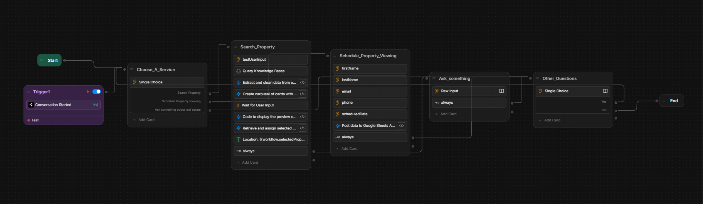

# 🏡 Real Estate Property Viewing Automation Bot  

This project is a **Real Estate Chatbot** built using **Botpress**, designed to help users search for properties, schedule property viewings, and get answers to real estate-related questions.  

## 🚀 Features  

- **Service Selection**  
  - Users can choose from:  
    - 🔍 Search Property  
    - 📅 Schedule Property Viewing  
    - ❓ Ask General Real Estate Questions  

- **Property Search**  
  - Accepts user input (e.g., location, budget, property type).  
  - Queries knowledge bases for property listings.  
  - Extracts and cleans property data.  
  - Displays properties in a carousel format.  
  - Waits for user selection and retrieves chosen property details.  

- **Schedule a Viewing**  
  - Collects user details (first name, last name, email, phone number, preferred date).  
  - Sends the booking data to **Google Sheets** for easy tracking.  

- **General Questions**  
  - Handles user queries about real estate.  
  - Provides a yes/no option to continue or end the conversation.  

## 🛠 Workflow Overview  

Below is the visual workflow of this chatbot:  

  

1. **Trigger**: Conversation starts → user chooses a service.  
2. **Search Property**: Bot searches, filters, and shows property options.  
3. **Schedule Viewing**: Bot collects user details and logs them into Google Sheets.  
4. **Ask Something**: Bot handles custom user input.  
5. **Other Questions**: Yes/No choice before ending the conversation.  

## 📂 File Structure  

- `real-estate-bot-flow.png` → Visual workflow of the chatbot.  
- `README.md` → Documentation file (this file).  
- (Botpress project files are managed inside Botpress Studio).  

## ⚙️ Setup & Deployment  

1. Install [Botpress](https://botpress.com/).  
2. Import the chatbot flow into your Botpress workspace.  
3. Configure integrations:  
   - **Knowledge Base** → Add property listings and real estate info.  
   - **Google Sheets API** → Enable and connect for data logging.  
4. Test the bot with the built-in emulator.  
5. Deploy to your website, WhatsApp, Messenger, or other supported channels.  

## ✅ Future Improvements  

- Integrate with a **live property database** (MLS, API).  
- Add **calendar integration** (Google Calendar, Outlook).  
- Include **AI-powered FAQ handling** for common real estate queries.  
- Add **multi-language support** for broader user reach.  
